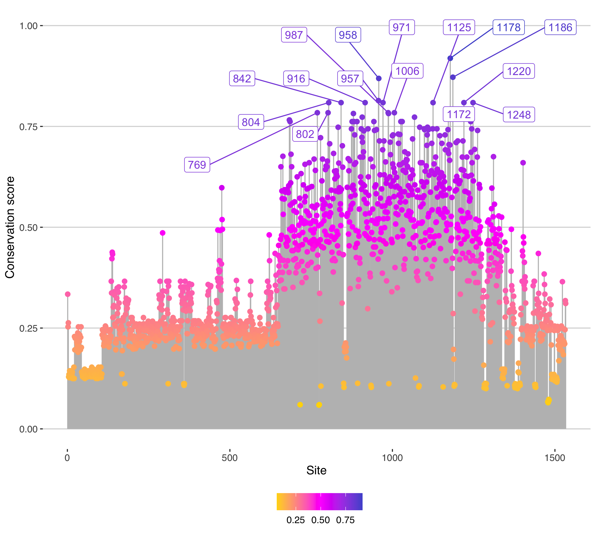

# calc-cons 

Scoring residue conservation a site in a Multiple Sequence Alignment (MSA) by using Jensen-Shannon Divergence (JSD). 

## Description 

* A Rust program that calculates conservation score per site in a MSA. 
* The scoring measure is based on JSD introduced by Capra and Singh [1]. 
* It takes account of background distribution, sequence weighting and gap penalty. 
* Optionally, a structural information for more detailed analyses can be used in this program. 
* Also, It contains some small R scripts for output data visualization. 

## Dependencies 

### colored ( version `2.0` or more ) 

* colored ( https://docs.rs/colored/latest/colored/ ) 

### rand ( version `0.8` or more ) 

* rand ( https://docs.rs/rand/latest/rand/ ) 

## Implementation 

The program should be compiled by using `Cargo`.🦀📦 

[ e.g. in optimized compilation ] 

``` 
% cd calc-cons-main 
% cargo build --release
``` 

Then, the object file `cons-carpra07` is generated in `./target/release` directory. 

## Scoring method 

### Conservation score 

In this program, the scoring measure is based on JSD. See more information about it below: 

* cons-capra07 ( https://github.com/shin-kinos/cons-capra07 )

### Background distribution 

A background distribution is required for calculating the Relative Entropy. This program supports 9 types of background distribution as follows: 

1. BLOSUM62 [2] 
2. AA composition of Swiss-Prot ( from UniProt Knowledge Base ) 
3. AA composition in extracellular proteins [3]
4. AA composition in membrane proteins [3]
5. AA composition in intracellular proteins [3] 
6. JTT [4] 
7. WAG [5] 
8. LG [6] 
9. Non-biassed distribution (equal rate at 0.05)  

Gaps are ignored as well as site distributions.  

### Sequence weighting 

this program supports 2 methods for reducing redundancy in a MSA as follows: 

* The Position-Based method by Henikoff and Henikoff [7]. 
* The Distance-Based method by Vingron and Argos [8]. 

### Gap penalty 

Finally, a gap penalty is given in each conservation score by using a simple gap-counting method. See more information about it below: 

* cons-capra07 ( https://github.com/shin-kinos/cons-capra07 ) 

## Input file format 

Multi-FASTA format of Aligned amino acid sequences. ⚠️NOTE that the nucleotide sequences are not supported. 

## Usage 

Major arguments:

`-i <string>` : Input filename in aligned Multi-FASTA format, REQUIRED.

`-o <string>` : Output filename, REQUIRED. 

`-w <string>` : Methods of sequence weighting ( "hen" or "va", default "hen" ). 

`-b <string>` : Background distribution ( default "blosum62" ). 

[ e.g. in `Q9BYF1.fasta.aln` as input file ]

``` 
% ./cons-capra07 -i Q9BYF1.fasta.aln -o output.txt -b swissprot -c yes -t no
``` 

Type `-h` to see other available options. 

## Output file format 

Site number`\t`Conservation score`\t`Site composition 

[ e.g. in `Q9BYF1.fasta.aln` as input file ] 

``` 
num	cons	site
1	0.334	----MM--M-
2	0.253	----KG--G-
3	0.263	----FA--A-
4	0.129	-----A----
5	0.135	-----S----
6	0.127	-----G----
7	0.144	-----Q----
8	0.138	-----R----
9	0.127	-----G----
10	0.144	-----Q----
11	0.127	-----G----
12	0.141	-----P----
13	0.141	-----P----
14	0.135	-----S----
15	0.141	-----P----
16	0.125	-----L----
17	0.125	-----L----
18	0.125	-----L----
19	0.125	-----L----
20	0.153	-----W----
21	0.125	-----L----
22	0.229	----HS----
23	0.196	----IL----
24	0.225	----LL----
25	0.225	----LL----
26	0.225	----LL----
27	0.225	----LL----
28	0.225	----LL----
29	0.215	----VP----
30	0.210	----GP----
...
``` 

## Data visualization 

A small R script `cons-capra07-plot.r` for result data visualization in `./plot` directory is also avairable. This scripts can be executed on your terminal. 

### Dependencies 

#### Tidyverse ( version `1.3.1` or more ) 

* Tidyverse( https://www.tidyverse.org/ ) 

#### ggplot2 ( version `3.3.5` or more ) 

* ggplot2 ( https://ggplot2.tidyverse.org/ ) 

#### ggrepel ( version `0.9.1` or more ) 

* ggrepel ( https://cran.r-project.org/web/packages/ggrepel/vignettes/ggrepel.html#overview ) 

#### ggthemes ( version `4.2.4` or more ) 

* ggthemes ( https://yutannihilation.github.io/allYourFigureAreBelongToUs/ggthemes/ )

### Input file format 

A result data file from `cons-carpra07`. 

### Usage 

The arguments are as follows: 

* `-i <string>` : Input file name, REQUIRED.
* `-o <string>` : Output file name. REQUIRED.
* `-c <integer>` : Types of colour gradient ( 1, 2, 3 or 4, default 1 ).
* `-w <integer>` : Size of width / px ( default 2500 ).
* `-h <integer>` : Size of height / px ( default 2250 ). 
* `-s <numeric>` : Size of data point ( default 1.0 ). 
* `-t <integer>` : Number of the annotated TOP ***n*** high conservation sites ( default 10 ). 
* `-T <string>` : Title of the graph.
* `-S <numeric>` : Size of the title ( default 20 ). 

### Annotation of high-ranked conservation scores 

This script can annotate the sites that are quantified in  the TOP ***n*** high conservation scores with `-t` option ( e.g., if `-t 30`, the TOP 30 high conservation sites are annotated. ). 

If you will not need any annotations, set `-t 0`. 

[ e.g. in `output.txt` as input file ] 

``` 
% Rscript cons-capra07-plot.r -i output.out -o cons-capar07-plot.r_example -c 4 -t 20 -T "Conservation score in C-type lysozyme MSA" -s 2
``` 
 

### Output file format 

A Lollipop Plot graph in PNG format. The X-axis is site number and the Y-axis is conservation score. See some example visualization files in `./image` directory. 

# cons-struct 

By integrating structural data into sequence alignment data, this program can provide more helpful information for predicting functionally or structurally important position in a protein. 

## Requirements 

### Voronota ( version `1.22` or more ) 

* Voronota ( https://bioinformatics.lt/wtsam/vorocontacts/help/standalone ) [9, 10] 

## Workflow 

Here is the workflow of `cons-struct`. 

### 1. Input sequence information and calculate conservation score 

Similar to `cons-capra07`, it scores conservation a site in the input Multi-FATSA. 

### 2. Input structural information

In mmCIF format. It is regarded as a target protein. 

### 3. Pin each conservation score to the target protein's residue. 

The calculated conservation scores are pinned to the target protein`s 
residues respectively. 

### 4. Execute Voronota to calculate Accessible Solvent Area (ASA) 

Voronota tool is executed to the target protein to calculate it's residues' ASA. 

### 5. Calculate RSA 

By using the Voronota output, RSA is calculated to each residue with the X-Ala-X tripeptide ASAs that were described by Shandar et al. [11] as follows: 

*  Ala : `110.2`
*  Arg : `229.0`
*  Asn : `146.4`
*  Asp : `144.1`
*  Cys : `140.4`
*  Gln : `178.6`
*  Glu : `174.7`
*  Gly : `78.7 `
*  His : `181.9`
*  Ile : `185.0`
*  Leu : `183.1`
*  Lys : `205.7`
*  Met : `200.1`
*  Phe : `200.7`
*  Pro : `141.9`
*  Ser : `117.2`
*  Thr : `138.7`
*  Trp : `240.5`
*  Tyr : `213.7`
*  Val : `153.7` 

### 6. Characterize the residues' solvent state 

Finally, the target protein's residues are derived into 3 types of the solvent state, described by Rost et al. [12] as follows: 

* Buried ( `RSA < 9%` ) 
* Intermediate ( `9% ≦ RSA ≦ 36%` )
* Exposed ( `RSA > 36%` ) 

## Flowchart 

The process overview of `cons-struct`:

 

## Implementation 

The program should be compiled by using `Cargo`.🦀📦 

[e.g. in optimized compilation ] 

``` 
% cd calc-cons-main 
% cargo build --release
``` 

Then, the object file `cons-struct` is generated in `./target/release` directory. 

## Input file format 

In this, the program requires 2 types of information as input files below: 

* Multi-FASTA format 
	* Aligned amino acid sequences. ⚠️NOTE that the nucleotide sequences are not supported. 
* mmCIF format 
	* A protein structural information. ⚠️NOTE that PDB format is not supported. 

## Usage 

Major arguments: 

* `--cif-input <string>` : Input filename in mmCIF format, REQUIRED. 
* `--cons-input <string>` : Input filename in Multi-FASTA format, REQUIRED.  
* `--cif-chainid <string>` : Chain ID of the input structural information, REQUIRED. 
* `--output <string>` : Output file name, REQUIRED. 
* `--cif-author <string>` : Use the Author Sequence ID ( "yes" or "no", default "yes" ). If "yes", `auth_comp_id`, `auth_asym_id` and `auth_atom_id` in `atom_site` Data Category are used. If "no", `label_comp_id`, `label_asym_id` and `label_atom_id` are used instead. 

Type `--help` to see other available options.  

[ e.g. in `6lu7.cif` and `aligned_6lu7.fasta` as input files ] 

```
% ./cons-struct2 --cif-input 6lu7.cif --cif-chainid A --cons-input aligned_6lu7_A.fasta --output output.out --cif-author yes  
```

## Output file format 

Number`\t`Conservation score`\t`Sequence Residue`\t`Residue number in sequence`\t`Chain ID`\t`Residue number in structure`\t`Structural residue`\t`ASA ( Å^2 )`\t`RSA ( % )`\t`Solvent state. 

Basically, Sequence residue and Structural residue will be identical. 

[ e.g. in `6lu7.cif` and `aligned_6lu7.fasta` as input files ] 

``` 
ConsNum	Cons	ConsRes	Number	ChainID	ResSeq	ResName	ResASA	ResRSA	State
1	0.711	SER	1	A	1	SER	138.198	117.916	exposed
2	0.790	GLY	2	A	2	GLY	32.893	41.795	exposed
3	0.622	PHE	3	A	3	PHE	31.508	15.699	intermediate
4	0.602	ARG	4	A	4	ARG	183.811	80.267	exposed
5	0.788	LYS	5	A	5	LYS	103.252	50.196	exposed
6	0.832	MET	6	A	6	MET	83.378	41.668	exposed
7	0.624	ALA	7	A	7	ALA	28.140	25.535	intermediate
8	0.555	PHE	8	A	8	PHE	19.420	9.676	intermediate
9	0.872	PRO	9	A	9	PRO	94.551	66.632	exposed
10	0.755	SER	10	A	10	SER	18.362	15.667	intermediate
11	0.698	GLY	11	A	11	GLY	52.199	66.327	exposed
12	0.382	LYS	12	A	12	LYS	70.236	34.145	intermediate
13	0.755	VAL	13	A	13	VAL	0.240	0.156	buried
14	0.837	GLU	14	A	14	GLU	85.757	49.088	exposed
15	0.497	GLY	15	A	15	GLY	20.084	25.520	intermediate
16	0.919	CYS	16	A	16	CYS	0.174	0.124	buried
17	0.613	MET	17	A	17	MET	14.461	7.227	buried
18	0.811	VAL	18	A	18	VAL	1.449	0.943	buried
19	0.641	GLN	19	A	19	GLN	31.120	17.424	intermediate
20	0.811	VAL	20	A	20	VAL	0.000	0.000	buried
21	0.605	THR	21	A	21	THR	26.139	18.846	intermediate
22	0.839	CYS	22	A	22	CYS	10.277	7.320	buried
23	0.730	GLY	23	A	23	GLY	66.927	85.041	exposed
24	0.603	THR	24	A	24	THR	127.316	91.793	exposed
25	0.674	THR	25	A	25	THR	23.612	17.024	intermediate
26	0.621	THR	26	A	26	THR	55.974	40.356	exposed
27	0.773	LEU	27	A	27	LEU	5.533	3.022	buried
28	0.876	ASN	28	A	28	ASN	0.000	0.000	buried
29	0.790	GLY	29	A	29	GLY	0.000	0.000	buried
...
``` 

## Data visualization 

As `cons-capra07-plot.r`, `cons-struct-plot.r` is a small R script for the output data visualization that is executed on your terminal. 

### Dependencies 

All the required packages and their versions are the same as `cons-carpra07-plot.r`s'. 

### Input file format 

A result output file of `cons-struct`.

### Usage 

The arguments are as follows: 

* `-i <string>` : Input file name, REQUIRED.
* `-o <string>` : Output file name. REQUIRED.
* `-w <integer>` : Size of width / px ( default 2500 ).
* `-h <integer>` : Size of height / px ( default 2250 ). 
* `-s <numeric>` : Size of data point ( default 1.0 ). 
* `-t <integer>` : Number of the annotated TOP ***n*** high conservation sites ( default 10 ). 
* `-T <string>` : Title of the graph.
* `-S <numeric>` : Size of the title ( default 20 ).

### Annotation of high-ranked conservation scores 

This script can annotate the sites that are quantified in  the TOP ***n*** high conservation scores with `-t` option ( e.g., if `-t 30`, the TOP 30 high conservation sites are annotated. ). 

If you will not need any annotations, set `-t 0`. 

[ e.g. in `struct_output.txt` as input file ] 

``` 
% Rscript cons-struct-plot.r -i output.out -o cons-struct-plot.r_example -T "Residue conservation score in 6LU7_A" -S 25 -s 3 -t 5
``` 

 


### Output file format 

A Lollipop Plot graph in PNG format. The X-axis is site number and the Y-axis is conservation score. See some example visualization files in `./image` directory.  

# Additional programs 

It provides you other small programs that may be helpful in this working. 

## Want to convert mmCIF into FASTA? 

If you consider that you get a sequence information from a structural information, use `convert-cif-to-fasta`. This program converts `mmCIF` format into `FASTA` format by using `atom_site` Data Category. 

You can see the detailed information for `atom_site` Data Category in `mmCIF` format below: 

* `atom_site` Data Category ( https://mmcif.wwpdb.org/dictionaries/mmcif_pdbx_v50.dic/Categories/atom_site.html ).

### Implementation 

The program should be compiled by using `Cargo`.🦀📦 

[ e.g. in optimized compilation ] 

``` 
% cd calc-cons-main 
% cargo build --release
``` 

Then, the object file `convert-cif-to-fasta` is generated in `/../../` directory. 

### Input file format 

`mmCIF` format. ⚠️NOTE that `PDB` format is not supported. 

See some example input files in `demo` directory. 

### Usage 

Options: 

* `-i <string>` : Input filename, REQUIRED. 
* `-o <string>` : Output filename, REQUIRED. 
* `-c <string>` : Chain ID, REQUIRED. 
* `-a <string>` : Whether it uses the Author ID information or not ( "yes" or "no", default "yes" ). If "yes", `auth_asym_id`, `auth_atom_id`, `auth_comp_id` and `auth_seq_id` Data Category items are used for converting from `mmCIF` into `FASTA`. If "no", `label_asym_id`, `label_atom_id`, `label_comp_id` and `label_seq_id` are used instead. 
* `-t <string>` : Name of the title line of the output FASTA file. 

[ e.g. in `6y2e.cif` as input file ] 

```
% cif-to-fasta -i 6y2e.cif -o output.fasta -c A -a no
```  

### Output file format 

FASTA format. 

## Want to construct a MSA from one sequence? 

`make-msa.zsh` is a small Shell Script ( Z shell ) that constructs Multiple Sequence Alignment ( MSA ) from one amino acid sequence by using some command-line tools. 

### Requirements 
This script uses **3** command-line tools below. Please make them executable by setting PATH.

#### 1. Local-BLAST

Version `2.11.0` ( or more ). 

* Local-BLAST ( https://ftp.ncbi.nlm.nih.gov/blast/executables/blast+/ ) [13] 

#### 2. CD-HIT 

Version `4.8.1` ( or more ). 

* CD-HIT ( http://weizhong-lab.ucsd.edu/cd-hit/ ) [14, 15] 

#### 3. MAFFT 

Version `7.475` ( or more ). 

* MAFFT ( https://mafft.cbrc.jp/alignment/software/ ) [16] 

### Workflow 

#### 1. Input an amino acid sequence 

In  FASTA format. 

#### 2. Collect similar homologue sequences 

It uses `blastp` command to collect similar sequences with it's options as follows: 

* `-evalue` : 10e-5 
* `-seg` : yes 
* `-outfmt` : "6 sseqid"  

Then, based on the output file, Multi-FASTA file is constructed by `blastdbcmd` command.

#### 3. Reduce redundancy 

By using CD-HIT, sequence redundancy in the Multi-FASTA file is reduced with it's `-c` command at `0.7`.

#### 4. Construct MSA 

Finally, MAFFT is executed with `--auto` option. 

### Usage 

#### 1. The PATH of Local-BLAST database 

Local-BLAST requires a database  for searching similar sequences. So please type full PATH of your Local-BLAST database to **line 5** of this script. 

```
#!/bin/zsh -eu

#########################################################################################
# Full path of blast+ database. [e.g.] blast_db=/Users/username/blast+/database/swissprot
blast_db= #Type your PATH here.

#########################################################################################

``` 

#### 2. Permission setting 

Give it execute permission with any methods.

[ e.g. in using `chmod` command ] 

```
% chmod a+x make-msa.sh
``` 
Then, you can run this script ( just one parameter, input file name ). 

[ e.g. in `ace2_human.fasta` as input file ] 

```
% ./make-msa ace2_human.fasta
``` 

## References

1. Capra, John A., and Mona Singh. "Predicting functionally important residues from sequence conservation." Bioinformatics 23.15 (2007): 1875-1882. 
2. Henikoff, Steven, and Jorja G. Henikoff. "Amino acid substitution matrices from protein blocks." Proceedings of the National Academy of Sciences 89.22 (1992): 10915-10919. 
3. Cedano, Juan, et al. "Relation between amino acid composition and cellular location of proteins." Journal of molecular biology 266.3 (1997): 594-600. 
4. Jones, David T., William R. Taylor, and Janet M. Thornton. "The rapid generation of mutation data matrices from protein sequences." Bioinformatics 8.3 (1992): 275-282. 
5. Whelan, Simon, and Nick Goldman. "A general empirical model of protein evolution derived from multiple protein families using a maximum-likelihood approach." Molecular biology and evolution 18.5 (2001): 691-699. 
6. Le, Si Quang, and Olivier Gascuel. "An improved general amino acid replacement matrix." Molecular biology and evolution 25.7 (2008): 1307-1320. 
7. Henikoff, Steven, and Jorja G. Henikoff. "Position-based sequence weights." Journal of molecular biology 243.4 (1994): 574-578. 
8. Vingron, Martin, and Patrick Argos. "A fast and sensitive multiple sequence alignment algorithm." Bioinformatics 5.2 (1989): 115-121. 
9. Olechnovič, Kliment, and Česlovas Venclovas. "Voronota: a fast and reliable tool for computing the vertices of the Voronoi diagram of atomic balls." Journal of computational chemistry 35.8 (2014): 672-681. 
10. Olechnovič, Kliment, and Česlovas Venclovas. "VoroContacts: a tool for the analysis of interatomic contacts in macromolecular structures." Bioinformatics (2021). 
11. Ahmad, Shandar, et al. "ASAView: database and tool for solvent accessibility representation in proteins." BMC bioinformatics 5.1 (2004): 1-5. 
12. Rost, Burkhard, and Chris Sander. "Conservation and prediction of solvent accessibility in protein families." Proteins: Structure, Function, and Bioinformatics 20.3 (1994): 216-226. 
13. Altschul, Stephen F., et al. "Basic local alignment search tool." Journal of molecular biology 215.3 (1990): 403-410. 
14. Fu, Limin, et al. "CD-HIT: accelerated for clustering the next-generation sequencing data." Bioinformatics 28.23 (2012): 3150-3152. 
15. Li, Weizhong, and Adam Godzik. "Cd-hit: a fast program for clustering and comparing large sets of protein or nucleotide sequences." Bioinformatics 22.13 (2006): 1658-1659. 
16. Katoh, Kazutaka, and Daron M. Standley. "MAFFT multiple sequence alignment software version 7: improvements in performance and usability." Molecular biology and evolution 30.4 (2013): 772-780. 
